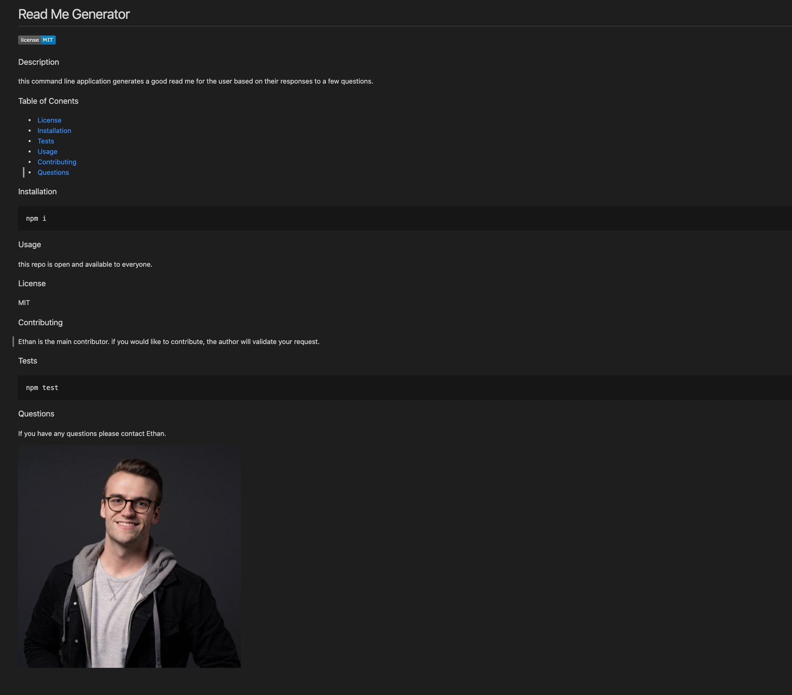
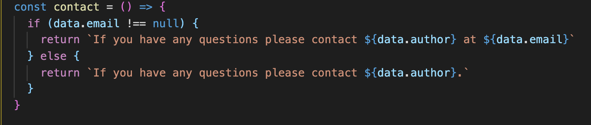
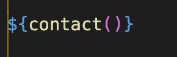

# Read Me Generator

### Description 
this command line application generates a good read me for the user based on their responses to a few questions. 

### Table of Conents

* [Usage](#Usage)
* [Screenshots](#Screenshots)

### Usage
this repo contains my homework! 

### Screenshots

Below is a screen shot of the end result.

The app uses a function called 'contact' to determine if the user has an associated email with their github. If they do the function uses that response to construct a message that includes a specific contact method. If they do not, it simply says "contact ____".

The function is called in the markdown and the result of the function is stored in the generated readme. 

~ Fin ~

